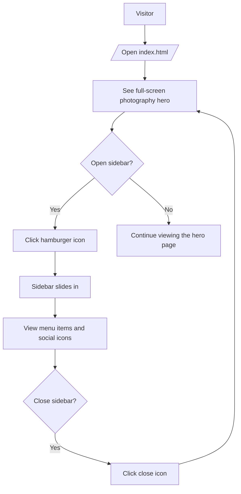

<p align="center">
	
</p>

<h1 align="center">Photography Website</h1>

<p align="center"><i>Static photography landing page built with HTML and CSS, featuring a full-screen background image and a CSS-only sliding sidebar menu.</i></p>

<p align="center">
	
	
	
	
	
	
	
	
	
</p>

## Table of Contents

- [🚀 Project intro](#project-intro)
- [📁 Project structure](#project-structure)
- [⭐ Differentiators](#differentiators)
- [🔧 Features](#features)
	- [Flow diagram](#flow-diagram)
	- [Interaction behavior](#interaction-behavior)
- [🧰 Tech stack](#tech-stack)
- [⚙️ Install methods](#install-methods)
- [🔐 Environment variables](#environment-variables)
- [📜 Available scripts](#available-scripts)
- [🚀 Deployment notes](#deployment-notes)
- [🤝 Contributing](#contributing)
- [📄 License](#license)

## 🚀 Project intro

This project is a simple static photography website built with HTML and CSS. It uses a full-screen background image, a left-side sliding menu, and icon-based navigation to create a focused landing-page experience without any JavaScript, backend, or database layer.

## 📁 Project structure

```txt
Photography-Website/
├── index.html
├── README.md
├── css/
│   └── style.css
└── Images/
    ├── logo.png
    └── photo.jpg
```

## ⭐ Differentiators

- CSS-only sidebar toggle driven by a hidden checkbox and label controls
- Full-screen photography hero background for an immediate visual focus
- Lightweight single-page layout with no build step or framework overhead
- Font Awesome icons and Google Fonts loaded from CDNs for simple presentation styling

## 🔧 Features

### Core features

| Feature | Status | Notes |
| --- | --- | --- |
| Full-screen landing page | ✅ Current | The main hero area fills the viewport with a photography background image. |
| Sliding sidebar menu | ✅ Current | A left-side menu opens and closes with smooth CSS transitions. |
| Navigation-style menu items | ✅ Current | Gallery, Shortcuts, Exhibits, Events, Store, Contact, and Feedback are shown as menu entries. |
| Social media icons | ✅ Current | Facebook, Twitter, Instagram, and YouTube icons appear in the sidebar footer area. |
| Responsive viewport setup | ✅ Current | The page includes the standard mobile viewport meta tag. |

### 🌊 Flow diagram

The Mermaid flow below shows the main interaction path for the page, from loading the landing screen through opening the sidebar and selecting menu actions.



### Interaction behavior

- The hamburger icon opens the sidebar by toggling a hidden checkbox.
- The close icon hides the sidebar with the same CSS toggle behavior.
- The menu items are present as placeholder links (`#`) inside a single-page layout.
- The social icons are displayed in the sidebar footer area for visual polish.

## 🧰 Tech stack

- **Markup:** HTML5
- **Styling:** CSS3
- **Icons:** Font Awesome 6.4
- **Typography:** Google Fonts (Poppins)
- **Runtime:** Browser-only static page

## ⚙️ Install methods

### 📦 Open locally

Prerequisites:

- A modern web browser

1. Clone or download this repository.
2. Open the project folder.
3. Open `index.html` directly in your browser to view the site.

If you prefer a local server, you can also serve the folder with any static file server or a VS Code Live Server extension.

## 🔐 Environment variables

No environment variables are required for this project.

Notes:

- All layout and behavior are handled in `index.html` and `css/style.css`.
- Font Awesome and Google Fonts are loaded from external CDNs, so the page needs internet access for those assets.

## 📜 Available scripts

This repository does not define any npm, yarn, or build scripts.

Useful manual actions:

- Open `index.html` directly for a quick preview.
- Use any static server if you want a local hosted experience during editing.

## 🚀 Deployment notes

- This project can be deployed as static files on any host that serves HTML, CSS, and image assets.
- Make sure the `css/` and `Images/` folders are included in the deployment output.
- GitHub Pages, Netlify, Vercel static hosting, or standard web servers can all serve this project as-is.

## 🤝 Contributing

- Fork the repository and create a feature branch.
- Keep pull requests focused and include verification steps.
- Avoid committing secrets or unnecessary generated files.

## 📄 License

No license file is currently included in this repository.
